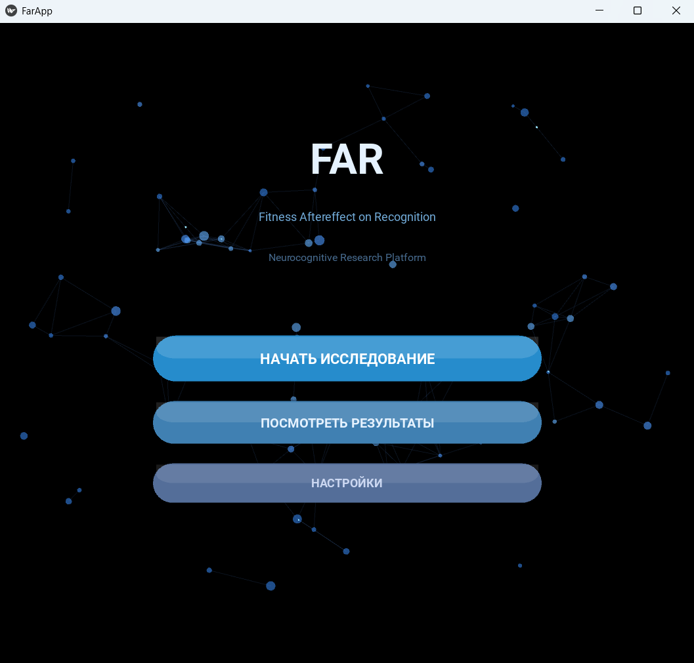
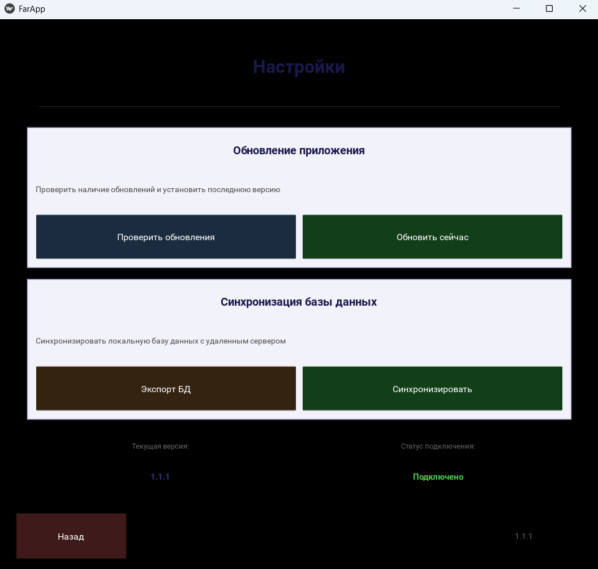

# FAR (Fitness Aftereffect on Recognition)
An application for conducting research on how people's ability to recognize fake images changes after physical activity
## User Interface
### Menu

### Settings
